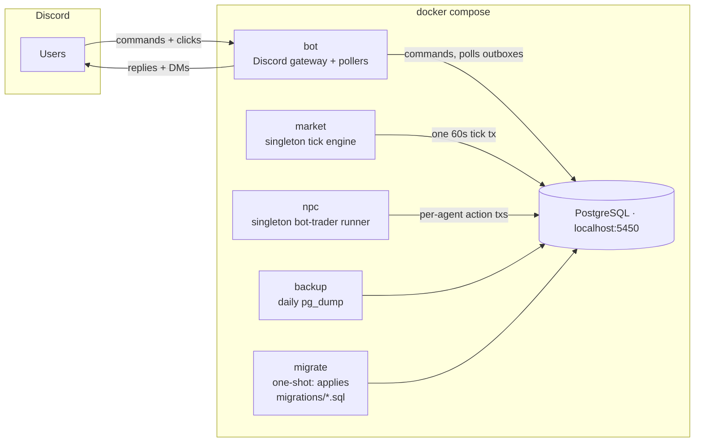
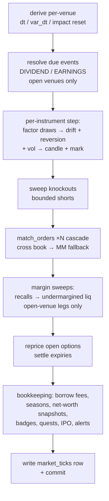
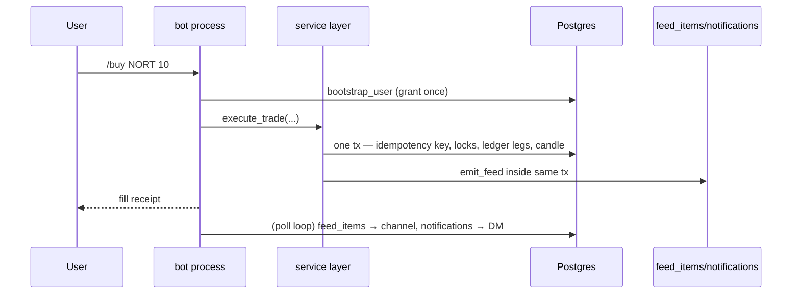

# Architecture

## Process topology

Five runtime processes plus the migrator. PostgreSQL is the only shared
state — processes never talk to each other, they coordinate *through*
the database (advisory locks, transactional outboxes, tick index).



- **`market`** (`python -m stockbot.market.main`) — the only writer of
  market state. Holds a session-scoped Postgres advisory lock
  (`pg_try_advisory_lock`), so an accidental second instance idles rather
  than double-stepping. Ticks every 60 s.
- **`npc`** (`python -m stockbot.npc.main`) — same advisory-lock pattern
  on a distinct key. Polls `MAX(tick_index)` and runs one `run_round`
  per new tick; each agent's action is its own committing transaction so
  NPC trades interleave with humans like real commands.
- **`bot`** (`python -m stockbot.bot.main`) — Discord gateway: slash
  commands, component (button) interactions, and four background pollers
  (heartbeat, notification outbox, public-feed outbox, leaderboard
  channel posts). Idles when `DISCORD_TOKEN` is unset.
- **`migrate`** — one-shot on boot; runs `migrations/*.sql` in filename
  order, each in its own transaction, tracking applied names in
  `schema_migrations`. No checksums — editing an applied file does
  nothing, so fixes ship as new numbered files.
- **`backup`** — daily `pg_dump -Fc` into a named volume, 14-day prune.

## The tick pipeline

One `apply_tick` call = one database transaction. Every sweep that
depends on the new marks runs inside the same tx, so a crash mid-tick
leaves either the whole tick or none of it.



Key properties:

- **Regional venues** — each instrument belongs to a `markets` row
  (US open 960/closed 480 offset 0; Asia open 600/closed 840 offset 720). A closed venue's instruments
  carry flat `CLOSED` candles and frozen marks; reopening venues step
  once with the overnight gap (`dt=closed_ticks`, `var_dt` scaled by the
  venue's `overnight_var_ticks`). Per-venue closing auctions suppress
  MM fallback inside `auction_ticks` of that venue's close.
- **Venue gating is total** — order matching, KO/alert/recall/margin
  sweeps, option repricing, and liquidation legs all take
  `open_market_ids` (`NULL` = every venue). Liquidation defers
  *per leg*: a closed-venue position stays undermargined, never
  force-settled at an unfillable mark.
- **Margin cascade** — undermargined accounts liquidate worst-first;
  unfillable legs defer; insurance fund then ADL backstop residual
  losses. `insurance_fund_flows` records every movement with a reason.
- **Deterministic order** — `match_orders` is a bounded outer loop
  (`stop_cascade_max_iters`) of `_match_once`; crossing pairs print at
  the maker's price inside a collar around the tick-open mark.

## Command flow (human action)



The same pattern — *idempotency key first, then lock, then mutate, then
outbox rows in the same transaction* — is used everywhere a Discord
interaction can be retried (trades, pack opens, subscriptions, shop
purchases). A rolled-back action can never leave a tape entry or a
notification for an event that didn't happen.

## Layering

```
bot/commands.py, bot/*_view.py          — Discord I/O only
    └─ services (trading, orders, margin, shorts, seasons,
               shop, collectibles, options, ipo, alerts, quests,
               status, admin, npc)
        └─ ledger.service               — double-entry posting
            └─ db.py                    — shared async pool
market/tick.py                          — engine; calls the same
                                          services for sweeps
feed/, bot/feed.py, bot/notify.py       — transactional outboxes
tools/                                  — doctor, replay (offline)
simulation/harness.py, npc/soak.py      — scratch-DB drivers
```

Rules of thumb the codebase follows:

- Money paths all resolve through the double-entry `ledger`; cached
  balances reconcile against it. Shards (collectibles) are deliberately
  *off*-ledger but still journaled (`shard_events`).
- Services never send Discord traffic; the bot layer renders. Feed and
  notification emission are inserts consumed by the bot's pollers.
- Per-action `conn.transaction()` boundaries: a command either fully
  lands or fully doesn't. Rollback semantics are part of the tests.
- `is_bot` NPC accounts ride ordinary USER accounts — every money path
  sees `kind='USER'` — but are excluded from human surfaces (leaderboard,
  wash detection, seasons, badges, quest stats, starting grant).
