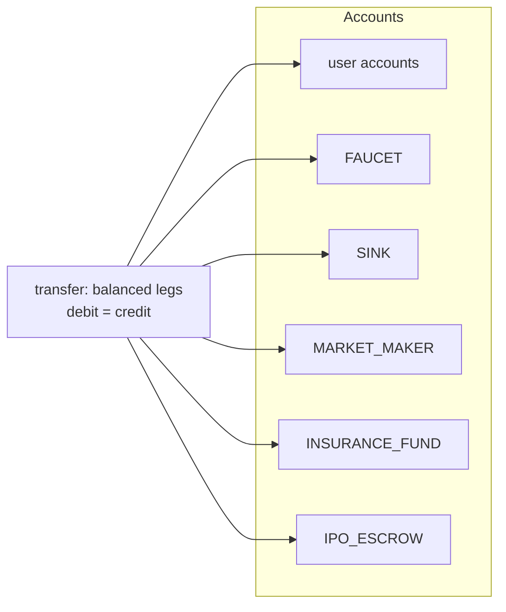

# Database

One PostgreSQL database is the entire system state — market, money,
game, and queues. No caches, no second store, no message broker.
Migrations are numbered `.sql` files applied in filename order by
`python -m stockbot.migrate`; each runs in its own transaction and is
recorded in `schema_migrations` **by filename only** — an applied file
is never re-run, so fixes to shipped migrations arrive as new files.

## Table families

| Family | Tables | Domain |
|--------|--------|--------|
| Identity | `users`, `accounts` | Discord-snowflake-keyed users; cash + margin accounts. `users.is_bot` marks NPC accounts. |
| Ledger | `transfers`, `ledger_entries`, `idempotency_keys` | Append-only double-entry ledger — every money movement is balanced legs to named accounts (FAUCET/SINK/MARKET_MAKER/FEES/…). |
| Market | `markets`, `instruments`, `sectors`, `market_ticks`, `candles`, `events`, `index_members` | Venues, listings, tick/candle history, scheduled dividends/earnings, index baskets. |
| Trading | `positions`, `trades`, `orders`, `bounded_shorts` | Positions, fills, resting LIMIT/STOP/STOP_LIMIT books, collateralized shorts. |
| Margin | `margin_accounts` (on `accounts`), `liquidations`, `insurance_fund_flows`, recall/adl state | True-margin shorts, liquidation engine, insurance fund + ADL backstop. |
| Seasons | `seasons`, `season_members`, league-scoped `positions`/`orders`/`accounts` | Time-boxed leagues with isolated accounts and equity snapshots. |
| Options | `option_contracts`, `option_positions` | Cash-settled calls/puts, BS pricing, venue-aware realized variance. |
| Shop/economy | `shop_items`, `entitlements`, `claims`, `claim_wheel`, `cash_transfers` | Purchases, consumable inventory (packs), daily claims, the claim wheel. |
| Meta | `badges`→`entitlements`, `quests`, `titles`, `themes`, `price_alerts`, `notifications` | Achievements, daily quests, cosmetics, user alerts, DM outbox. |
| Tape | `feed_channels`, `feed_items` | Per-guild public-feed bindings + fan-out outbox. |
| Collectibles | `card_sets`, `cards`, `user_cards`, `card_pulls`, `shard_events` | Card catalog (frozen sets), binder rows, provably-fair pull audit, shard journal. |
| NPC | `npc_agents` | Synthetic traders: archetype, stake, permadeath stamp, enabled flag. |
| IPO | `ipo_offerings`, `ipo_subscriptions` | Offerings and pro-rata subscriptions. |
| Ops | `config`, `schema_migrations`, `market_ticks.heartbeat`, `wash_trade_flags`, `net_worth_snapshots`, `chart_prefs`, `leaderboard_channels` | Tunable config, migration ledger, liveness, compliance, history snapshots, per-user UI prefs. |

Exact table definitions live in `migrations/` — treat this map as the
orientation layer, not the schema reference.

## The ledger contract

- Every money movement is a `transfer` with `ledger_entries` legs that
  sum to zero. Nothing else moves money — no direct `UPDATE` to cash
  balances except through a posting.
- `accounts.balance_minor` is a *cache*; `/admin recalc-balances` and
  `ledger_audit` recompute it from entries and flag drift.
- `idempotency_keys` is written first inside every mutating tx so a
  retried Discord interaction replays as a no-op
  (`DuplicateInteractionError`).
- `insurance_fund_flows` logs each fund movement with a `reason`
  (`LIQ_COVER`, `LIQ_PENALTY`, `ADL_BACKSTOP`, `BORROW_FEE`, …) plus an
  `mm_absorbed_minor` column distinguishing fund-paid vs
  market-maker-absorbed shortfalls — the fund's balance is derived by
  summing flows, never stored as a magic number.

## Audit & retention philosophy

Rows that *prove* history are never pruned:

- **`card_pulls`** — every pack pull: `pull_seq`, `pity_count_before`,
  outcome, and `pull_cfg` (the snapshotted weights/pools/floor). This is
  the fairness record; retention is forever by design.
- **`shard_events`** — signed delta for every `users.shards` mutation
  (`DUPLICATE_BURN`/`CRAFT`/`FRAME_UPGRADE`/`LEGACY_ADJUST`), giving the
  checkable invariant `users.shards = SUM(delta)`.
- **`trades` / `transfers` / `market_ticks`** — the replayable market
  record (see [determinism.md](determinism.md)).
- **`feed_items`, `notifications`** — transactional outboxes: written in
  the event's own tx, deleted only after confirmed delivery.
- **`wash_trade_flags`** — compliance findings, kept for audit.

Mutable config (`config` rows) is *not* snapshotted anywhere except the
pull records — `/admin tune` changes future behavior only.
