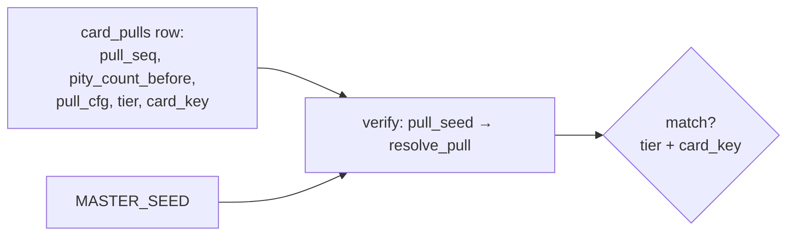

# Determinism & replay

StockBot's headline engineering property: **the same inputs always
produce the same outputs, and the inputs are on the record.** This is
what makes price history auditable, card packs provably fair, and NPC
behavior reconstructable.

## Seeded RNG

All stochastic draws derive from one `MASTER_SEED` (env secret) by
domain-separated HMAC-SHA256 — never a shared `random` instance, so
draw order can't be perturbed by unrelated code paths:

| Domain | Seed derivation | Where |
|--------|-----------------|-------|
| Tick factors | `rng_for_tick(master_seed, tick_index)` — feeds market/sector factor draws | `market/engine.py` |
| Per-pull | `pull_seed(master, user_id, pull_seq)` = HMAC(`master|packs`, `uid|seq`) | `collectibles/pull.py` |
| NPC agents | per-agent tick-keyed RNG | `npc/agents.py` |
| Event hashes | dividend/earnings payer selection | `market/events.py` |

`MASTER_SEED` is baked into all history — set it before first boot;
changing it later forks the universe.

## Factor replay (the market)

`tools/replay.py` re-derives stored factor draws tick-by-tick and
compares them against what `market_ticks` recorded:

```bash
python -m stockbot.tools.replay --from 4000 --to 5000 \
    --master-seed "$MASTER_SEED"
```

- Replays `market`/`sector` factor draws, per-instrument variances, and
  `session_state` to ~1e-9.
- **Venue-bounded**: each venue only participates in replay from the
  tick of its first OPEN candle — replaying pre-Asia history runs
  US-only instead of retroactively "opening" a venue that didn't exist
  then.
- Known limitation: the venue bound comes from `candles`, so a venue
  whose instruments were all delisted before it ever opened has no
  debut marker (documented in the module docstring).

## Provably fair packs (collectibles)

Every `card_pulls` row is self-verifying:



`pull_cfg` (JSONB) snapshots *every* input `resolve_pull` consumed —
tier weights, the ordered pools, `pity_threshold`, and the per-pull
premium floor — so a verifier replays `(master_seed, row)` alone.
`/admin tune` retunes and Set-2 expansions cannot invalidate history.
Rows predating migration 0061 carry `pull_cfg = NULL` and only replay
against a frozen config.

Two draws, fixed order, no branch-dependent consumption:

1. `rng.random()` → tier roll over `pack.rate_*` weights (pity and the
   premium floor are clamps *inside* the roll, not rerolls).
2. `rng.randrange(len(pool))` → card inside the tier's ordered pool.

## NPC determinism

NPC agents consume a tick-keyed per-agent RNG — `run_round` replays
identically for a given tick across runner restarts. The runner also
modulates `npc.action_prob_per_tick` by the observed bot share of
trailing-day notional toward `npc.target_adv_share` (clamped
[0.25×, 4×]); the modulation itself is deterministic given the recorded
`trades` table.

## What is NOT replayable by design

- Wall-clock artifacts: `created_at`, delivery timestamps, reveal
  animations.
- Configuration-dependent *interpretation* of old rows other than the
  snapshotted pull contract — e.g. fee config in effect at fill time is
  not re-derivable (fills are recorded facts, not recomputed).
